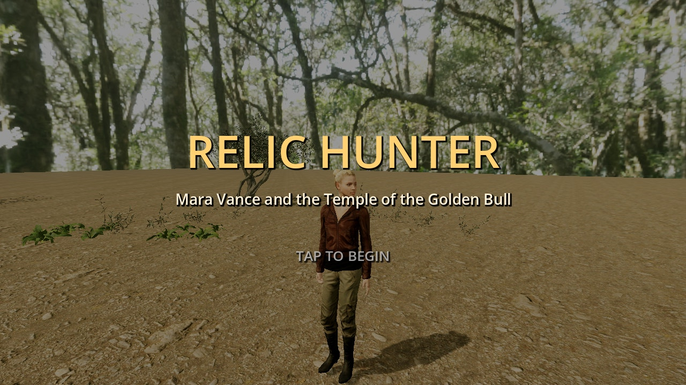
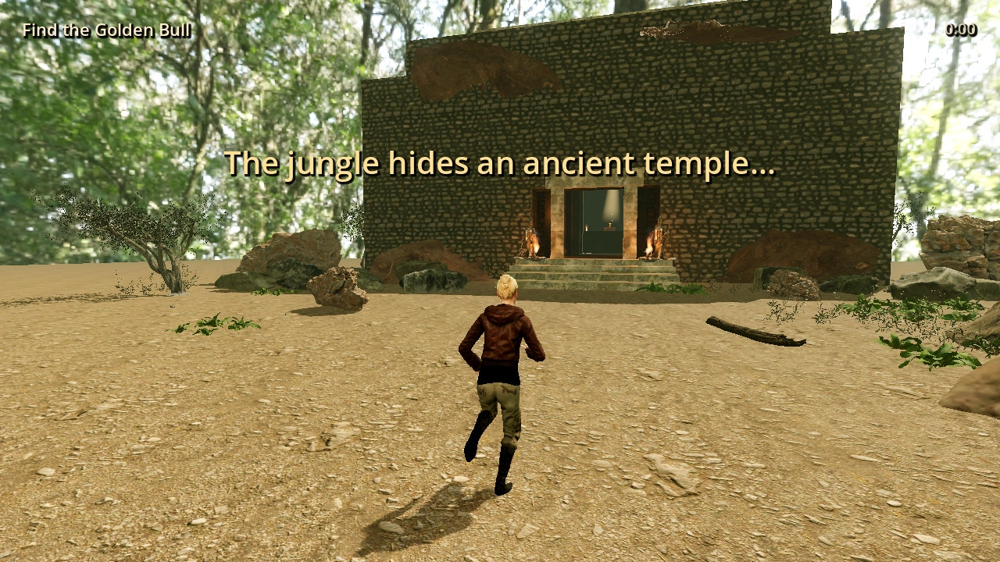
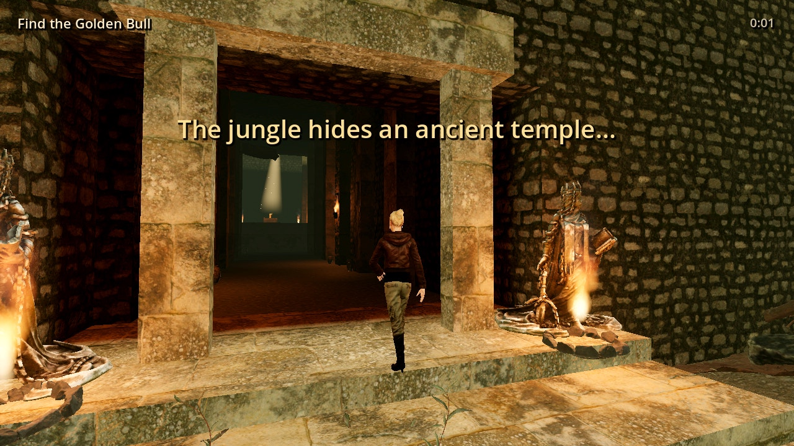
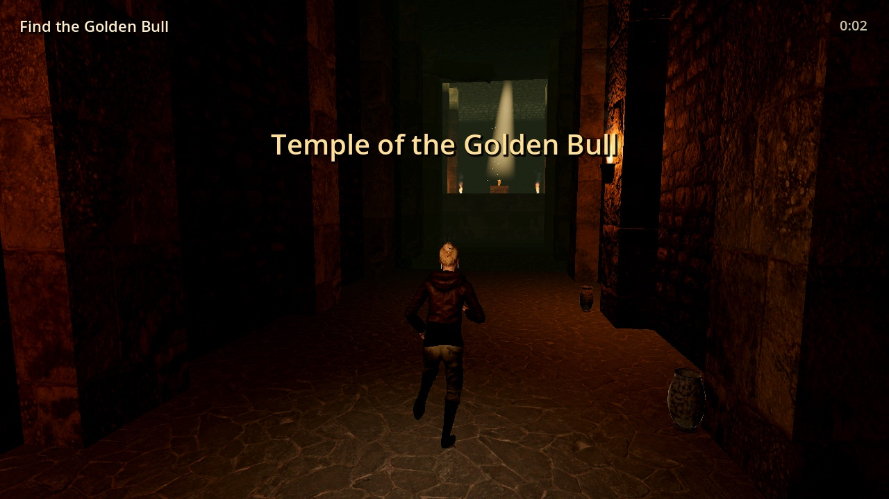
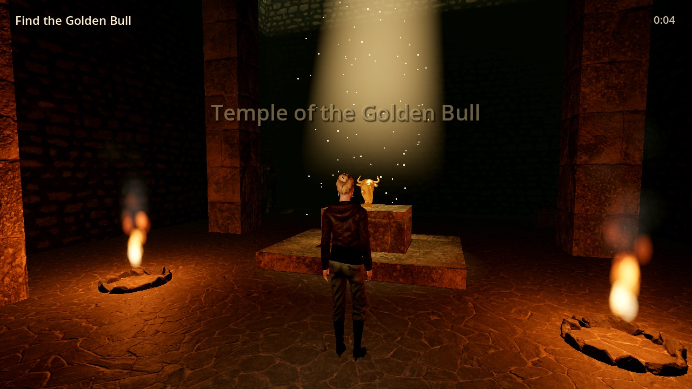
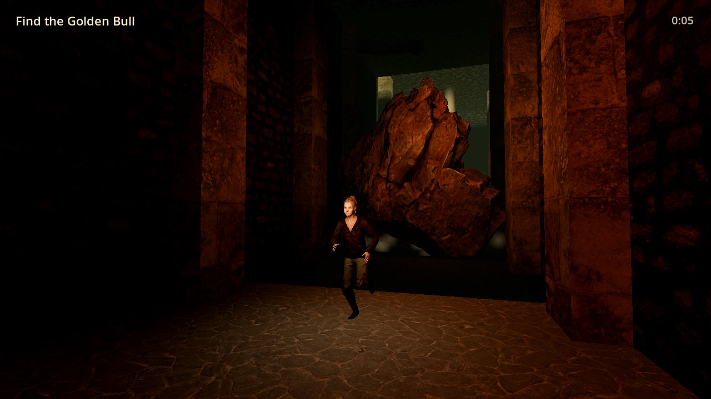

# Relic Hunter: Temple of the Golden Bull

A third-person action-adventure for Android, built with **Godot 4.4** (Mobile renderer).
You play Mara Vance, an explorer who crosses a jungle clearing, enters a torch-lit
temple, jumps a spike pit, climbs a ledge, takes the Golden Bull idol, and outruns
a giant boulder to the exit.

This repo is one polished vertical-slice level with realistic graphics:

- Photo-scanned PBR materials and models (Poly Haven), an HDRI jungle sky, sun shadows,
  fog, glow, flickering torch lights, a light shaft with dust motes over the idol
- A realistic, fully rigged heroine (Microsoft Rocketbox) with mocap idles and
  retargeted run/walk animations, plus authored jump, fall, hang and climb poses
- Touch controls: a floating joystick, drag to look, and JUMP / GRAB buttons

## Screenshots

| | |
|---|---|
|  |  |
|  |  |
|  |  |

## Controls

| Action | Touch | Keyboard (desktop testing) |
|---|---|---|
| Move | Left half of the screen: floating joystick | WASD (hold Shift to walk) |
| Look | Drag on the right half | Right mouse drag |
| Jump / climb up from a ledge | JUMP | Space |
| Take the idol / let go of a ledge | GRAB / TAKE | E |

Jump toward a wall to grab its ledge automatically. While hanging, push toward the
wall (or press JUMP) to climb up, or pull away (or press GRAB) to drop.

## Project layout

```
game/
  project.godot, export_presets.cfg
  scenes/main.tscn             entry scene (just runs scripts/game.gd)
  scripts/
    game.gd                    game flow: title, checkpoints, idol, boulder, win
    level_builder.gd           builds the whole level from boxes + props
    player.gd                  movement, jump, ledge grab/hang/climb, death
    heroine_model.gd           avatar, skin/hair shaders, animation playback
    camera_rig.gd              orbit camera, collision, auto-follow, shake
    touch_controls.gd          joystick, look drag, buttons
    boulder.gd, torch_fire.gd, hud.gd
  shaders/                     character skin/cloth and hair
  tools/
    bake_heroine_anims.gd      retargets Mixamo clips onto the Biped rig
    playtest_bot.gd            headless bot that plays the level end to end
    screenshots.gd             renders showcase screenshots
  assets/                      models, textures, HDRI, heroine
```

## Building the Android APK

Requirements: Godot 4.4.1 with Android export templates, the Android SDK (platform-tools,
build-tools 34, platform 34), and JDK 17+.

1. In Godot, set **Editor Settings → Export → Android** (SDK path, debug keystore).
2. Open `game/` and use **Project → Export → Android**, or run headless:

```sh
cd game
godot --headless --import
godot --headless --export-debug "Android" ../build/RelicHunter.apk
adb install -r ../build/RelicHunter.apk
```

The preset targets `arm64-v8a` (all modern Android phones), landscape, immersive mode,
package `com.relichunter.temple`. For a Play Store release, create a release keystore,
switch to an AAB (Gradle build), and sign with it.

iOS: the same project exports to iOS from a Mac with Xcode (Project → Export → iOS).

## Testing

```sh
cd game
# Plays the whole level headless: pit jump, ledge grab, climb, idol, boulder escape.
godot --headless --fixed-fps 60 -s tools/playtest_bot.gd
# Simulates a slower player who waits 1.5 s after taking the idol.
REACTION_FRAMES=90 godot --headless --fixed-fps 60 -s tools/playtest_bot.gd
# Renders screenshots to /tmp/shots (needs a GPU, or Mesa lavapipe + xvfb-run).
xvfb-run godot --rendering-method mobile --fixed-fps 30 -s tools/screenshots.gd
```

## Credits and licenses

- **Environment models, textures and HDRI:** [Poly Haven](https://polyhaven.com), CC0.
  The heavier scans were simplified with gltfpack for mobile.
- **Heroine avatar and idle animations:** [Microsoft Rocketbox Avatar Library](https://github.com/microsoft/Microsoft-Rocketbox),
  MIT license (see `game/assets/characters/heroine/ROCKETBOX_LICENSE.md`).
- **Walk and run motion:** Mixamo animations taken from the three.js examples (`Soldier.glb`)
  and retargeted to the heroine. They're used under Adobe's Mixamo terms and are only needed
  at bake time, not shipped in the APK.
- Mara Vance and the Temple of the Golden Bull are original to this project.
